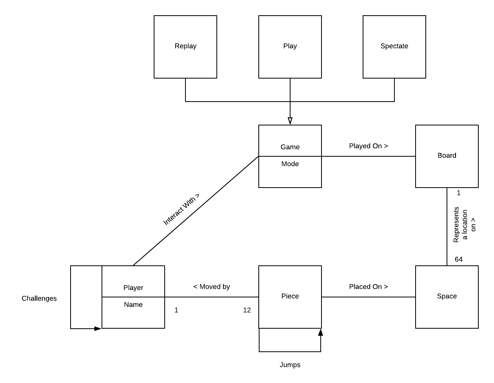
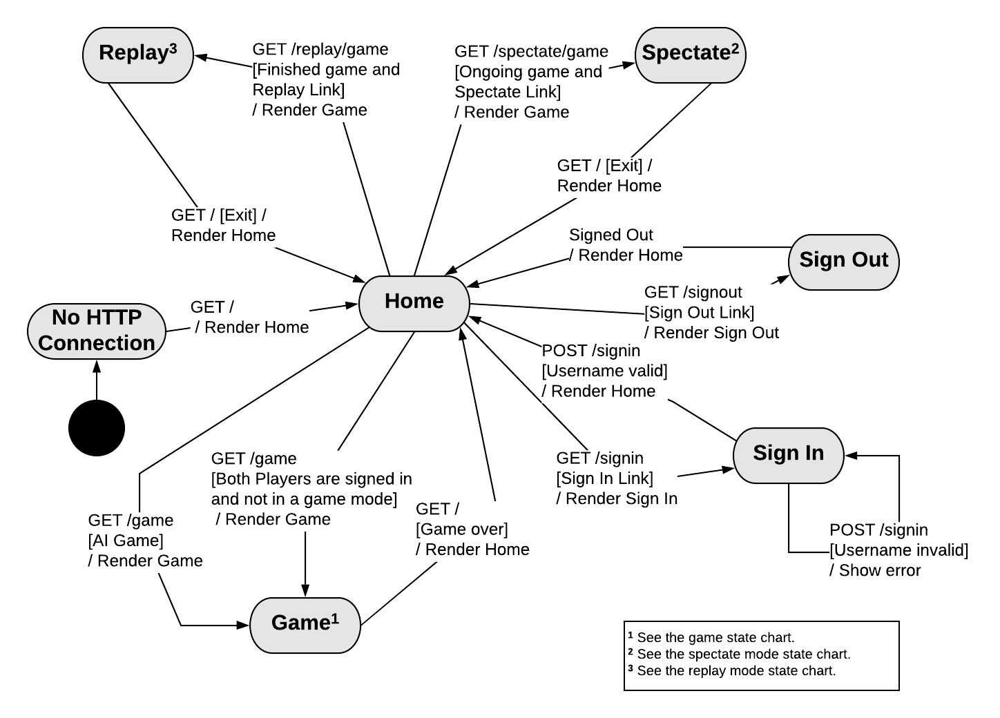
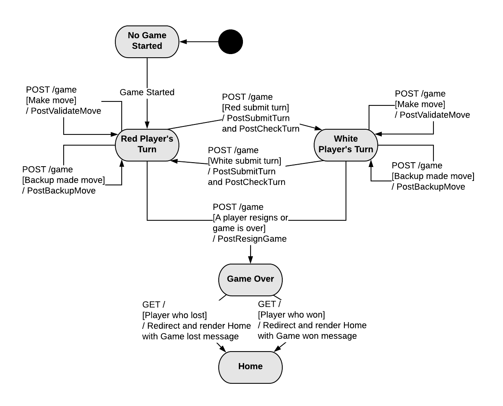
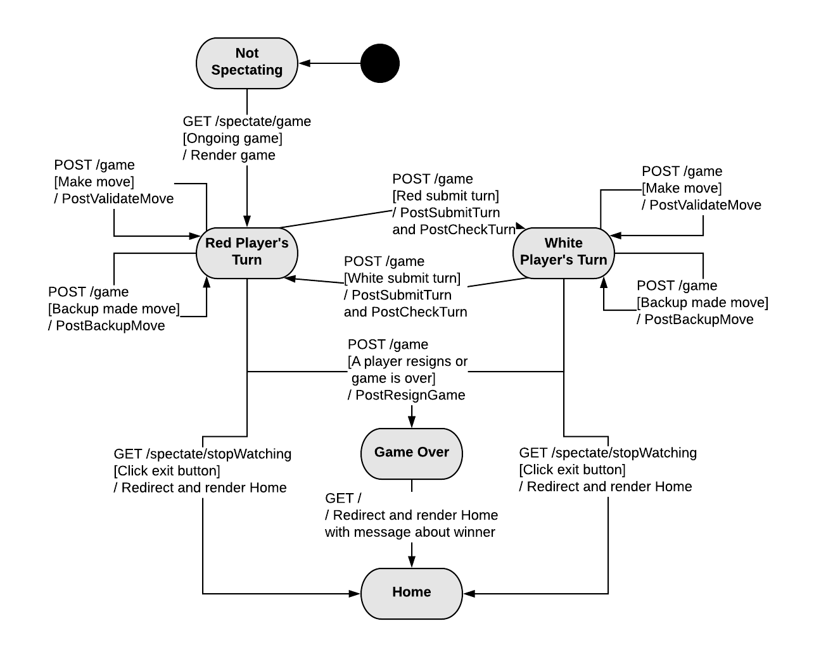
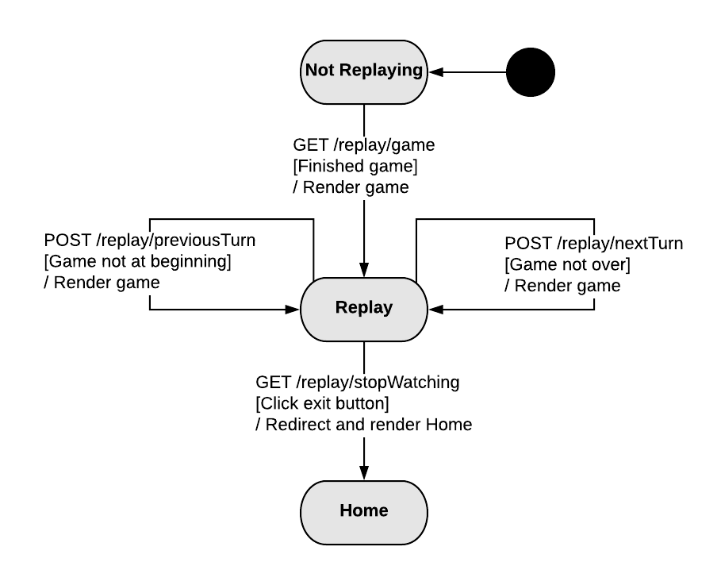
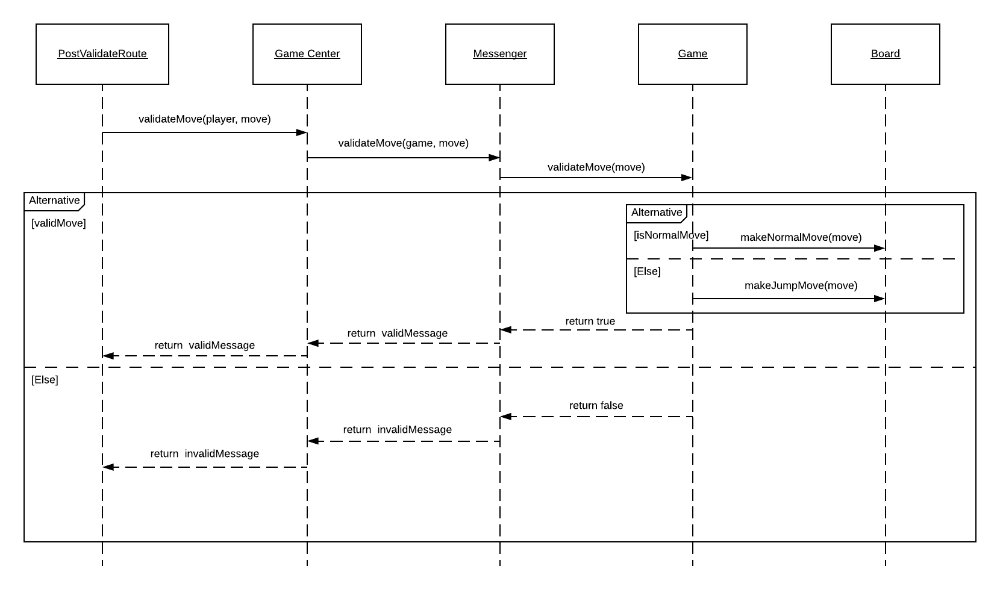
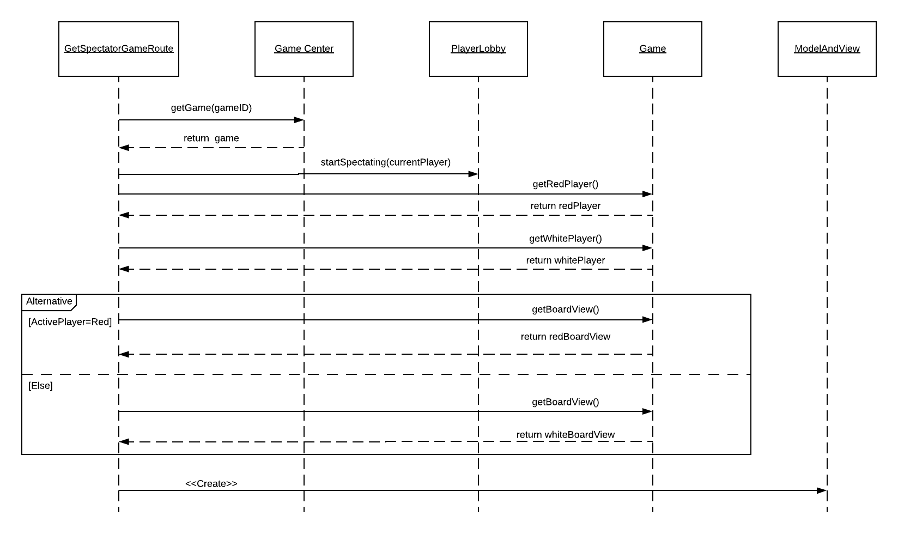
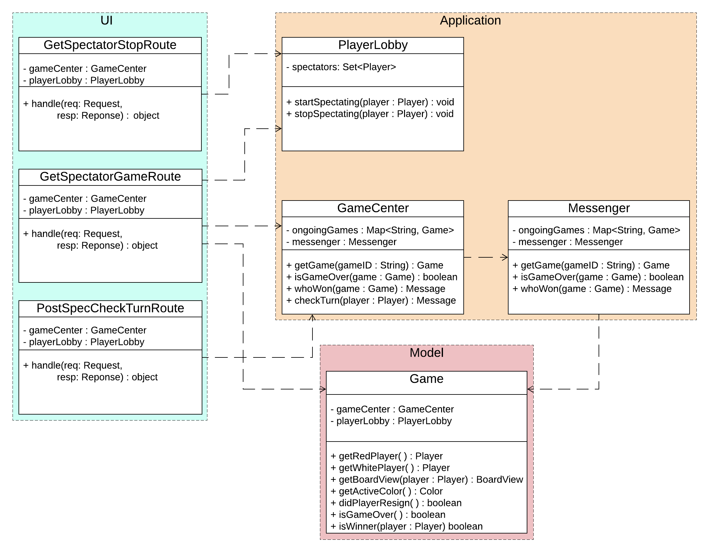
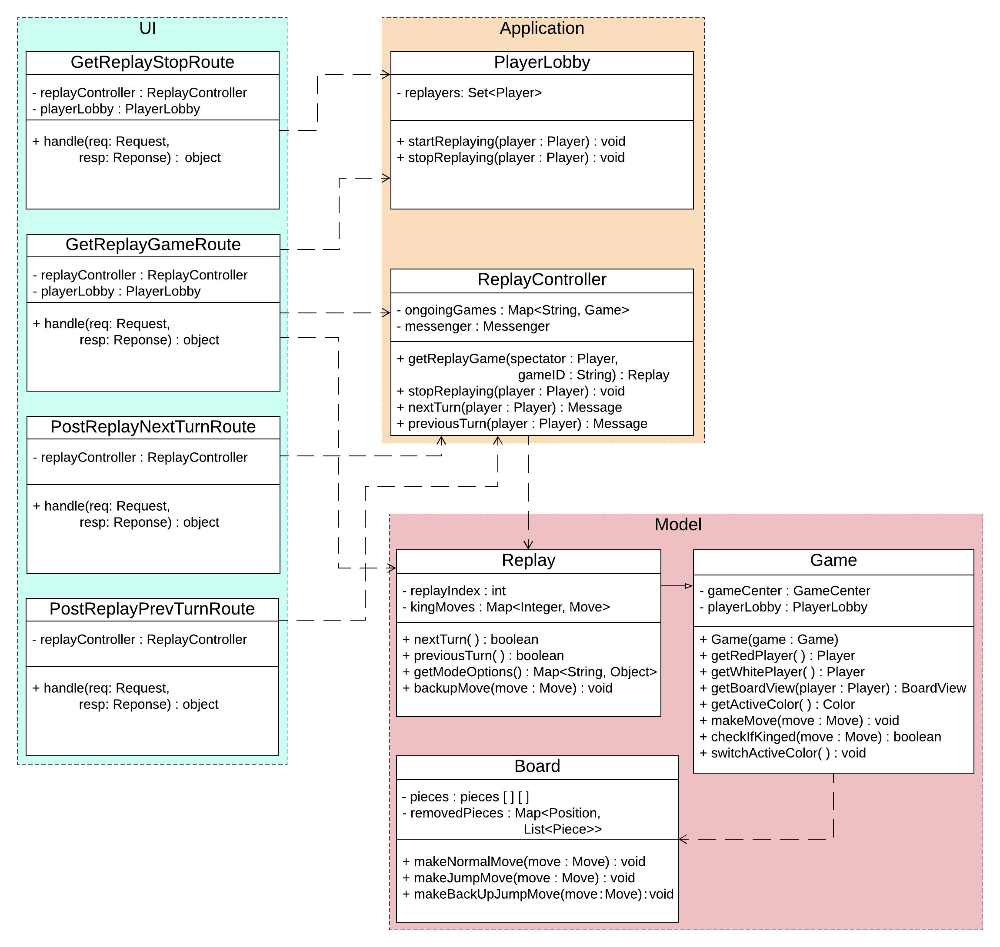

# PROJECT Design Documentation

## Team Information
* Team name: Banana
* Team members
  * Hersh Nagpal
  * Michael Kha
  * Luis Gutierrez
  * Matthew Bollinger
  * Christopher Daukshus

## Executive Summary

WebCheckers is a web-based version of the game of checkers built using the
Spark web framework and the FreeMarker template engine that is run on Java8.
Within this document are the details for the design of the system
and its subsystems.

### Purpose
The goal of this project is to have a functional application that allows users
to play a game of checkers with other users. Users select an opponent or wait
to be selected to begin a game within the player lobby. Players can expect to
play under the American rules for checkers until a player wins or resigns.

To meet this goal, users must be able to sign into the application and
interact with other users from the player lobby on the home page.

Users can also start a game with a computer player, spectate ongoing games, and
replay finished games. These features are accessed by clicking links on the home
page.

### Glossary and Acronyms
| Term | Definition |
|------|------------|
| VO | Value Object |
| MVP | Minimum Viable Product |
| UI | User Interface |
| Player | Signed-in user |
| AI | Artificial intelligence |
| Multiple Jump Move | Jump moves performed in succession on the same turn by the same piece |
| End-game Condition | A game can be won when a the other player has no more pieces or moves on their turn |
| Game Over | A game is finished when a player resigns or an end-game condition is met |
| Ongoing Game | A game has not reached the state where the game has is over |
| Finished Game | A game has reached the state where the game has been over |

## Requirements

This section describes the features of the application.

### Definition of MVP
WebCheckers is an application in which players can challenge each other to
checkers games over the internet. Players will be able to log in to a website
and see a list of other players who are online. Clicking a player will challenge
them to a game of checkers. If they accept, a game of checkers will be created.
The game will follow the regulations of American Checkers. Players can resign at
any time.

### MVP Features
- Player Sign-In
- Player Sign-Out
- Start A Game
- Piece Movement
  * Normal Move
  * Jump Move
  * Multiple Jump Move
- King Pieces
- End Game
  * Player Resigns
  * All Pieces Eliminated
  * No More Valid Moves

### Roadmap of Enhancements
1. AI Player: Players may play a game against an artificial intelligence player.
2. Spectator Mode: Other players may view an on-going game that they are not playing.
3. Replay Mode: Games can be stored and then reviewed at a later date.
4. Player Help: Extend the Game View to support the ability to request help.
5. Asynchronous Play: Players can play asynchronously.
6. Multiple Games: A player may play more than one game at a time.
7. Tournament Play: Players can enter into checkers tournaments including player statistics.

## Application Domain

This section describes the application domain.

Players sign in to interact with checkers games. Interacting includes playing, replaying, or
spectating a game. The game is played on a standard 8x8 checkers board. The pieces are
located on individual spaces. Players play against another player, taking turns moving
pieces and capturing their opponents pieces.

## Architecture and Design

This section describes the application architecture.

### Summary

The following Tiers/Layers model shows a high-level view of the webapp's architecture.

As a web application, the user interacts with the system using a
browser.  The client-side of the UI is composed of HTML pages with
some minimal CSS for styling the page.  There is also some JavaScript
that has been provided to the team by the architect.

The server-side tiers include the UI Tier that is composed of UI Controllers and Views.
Controllers are built using the Spark framework and View are built using the FreeMarker framework.
The Application and Model tiers are built using plain-old Java objects (POJOs).

Details of the components within these tiers are supplied below.

### Overview of User Interface

This section describes the web interface flow; this is how the user views and interacts
with the WebCheckers application.

Users can expect to be connected to the home page where they will have the option to sign in.
Upon visiting the sign in page, users are prompted to enter a username. A username must follow
specific criteria to be valid. Once a user has signed in, they will be able to see other players
that are signed in on the home page. The user can start a game by selecting another player that
is not yet in a game. When a game starts, the user that starts the game gets to go first. Each player
takes turns making moves until a winner has been decided. A turn consists of a player making a valid
move on the board and then having a choice of confirming or undoing their move using the submit turn
and backup buttons. A player may also choose to resign from the game before making a move. When a
game of checkers is over, both users will see a message indicating the outcome of the game and now
be able to go back to the home page to start a new game.

### UI Tier
The server-side UI tier is structured by the actions needed for displaying and updating pages.
Each route is specialized to do a task by communicating with the application tier services.
Provided below is each page and the routes that are used as well as a description.

#### Pages
- Home Page
  * This is the first page a user sees. They are greeted by a page that shows information
   depending on the login status of the user.
  * The GetHomeRoute handles what the page displays. If a player is not yet signed-in, they see
  the number of players online. If a player is signed-in, they see the names of other online players.
  * From the home page, a signed-in player can select another player to start a game. If the
  other player is already in a game then no game is started and the user is informed by a message.
  * The route also checks if the user is in an ongoing game to redirect them to the game page.
- Sign-In Page
  * Upon clicking the sign-in link in the navigation bar, the user go to the sign-in page by the GetSignInRoute.
  * The user will proceed to enter a name into the sign-in form. PostSignInRoute makes sure that the
  username is valid in all cases (the name has not been taken and follows the sign-in conventions).
  * Once the user enters a valid name, PostSignInRoute redirects the now logged-in player back to the home page.
  * At any time, users can sign out and be redirected to the home page.
- Game Page
  * Players that are already in a game, spectating a game, or replaying a game are in a busy state and
  redirect the challenger back to the home page with a message explaining the reasons listed above.
  * Players will see the board view representation of the board that is oriented to the bottom of the grid.
  * The turn is checked by the PostCheckTurnRoute every 5 seconds by an ajax call.
  * When a player makes a move on the board, the PostValidateMoveRoute makes sure that the move is valid.
  * After making a valid move, a player will then have the choice of submitting the turn or backing up
  from the move. These actions are handled by the PostSubmitTurnRoute and PostBackupMoveRoute.
  * At any point of the game, a player can resign from the game and return to the home page.
  The other player will see a message indicating that this player resigned.

### Application Tier
The application tier facilitates interactions between the game objects of the model and the server and
client communication of the UI. When the UI requires access to the model classes, whether to create,
alter, or display them, the UI first goes through the correct application tier manager class.

#### Services and Controllers
- GameCenter
* Each route located in the UI tier uses GameCenter to get information from game objects in the model package.
  GameCenter creates and manages games by storing them in a list of ongoing games and ended games. Given that
  the games are managed in this class, we adhere to both the information expert and single responsibility design
  principles as we contain the responsibility of getting the current player's game and calling the appropriate method
  from that game in GameCenter. The following are examples of how GameCenter connects UI tier routes to games.
    1. PostSubmitTurnRoute requires a message communicating whether the player's submit action is valid or not. The
    route calls the method "submitTurn" in gameCenter that gets the player's game and returns the appropriate message.
    2. PostCheckTurnRoute requires a message communicating whether the player's opponent has submitted a turn. The
    route calls the method "checkTurn" in gameCenter that gets the player's game from the list of games and returns the
    appropriate message.
    3. GetGameRoute must acquire the game object that the session's player started in order to render the game page
    by first checking if the session's player is in a game already. The route checks if this is true using the method
    playerInGame(player) in gameCenter which uses the list of games that exist to check if player is in one of them.
    GetGameRoute also uses the method getGame(player) to get the game object from a player already in a game in order
    to render the game. The route also uses the methods isGameOver and isWinner in gameCenter to display the
    appropriate message given that a player resigns.
    4. PostValidateRoute goes through the same steps of acquiring the correct message (ValidMove or InvalidMove) by
    by using GameCenter to return the correct message obtained by calling validateMove() in Messenger, which uses Game
    to return true or false depending on whether the move follows the American Checkers rules.

    

- Messenger
  * Many routes require appropriate messages to display depending on system events like valid/invalid move, opponent
  resignation, or player resignation. The class Messenger was created to hold all messages needed to be displayed for
  all system events. Routes that require messages from messenger go through gameCenter which will call the appropriate
  messenger method. Messenger methods will in turn return the appropriate message by checking game state through a game
  object.
- PlayerLobby
  * Determines a valid username to allow users to sign in.
  * Keeps track of all players that are signed in and when they sign out.
  * Holds the state of players in lists to determine what a player is currently doing. Used to check if a player
  can start playing a game with their opponent by checking if that opponent is not spectating or replaying a game.
- ReplayController
  * Shares a map of finished games with the GameCenter for ease of access.
  * Replays are created when a player starts replaying a game. A replay consists of copying a finished game
  to not overwrite moves made. The purpose of copying a game is to allow for multiple users to replay the same
  game without accessing the same state.
  * When a player starts replaying, that player is recorded with that game as the current replay.
  * Replays consist of turns which are updated by the controller by calling the replay methods and returning
  messages to the UI about whether changing the turn was successful.
  * A player cannot start a new replay until they stop replaying by clicking the exit button.
  * When a player is done replaying, this controller removes the record of that player replaying a game
  so that they can start another replay.

### Model Tier
- The model tier is a collection is a collection of objects and types that make up the basic structure
of the checkers game. The Board, Space, and Piece classes are examples of game objects. Color,
MessageType, and ViewMode are examples of types that describe other objects or states that objects
can be in. The main hierarchy of the board is contained in the Board class.
- Fabricated classes that were not part of the problem description include MoveManager, MoveBrain,
BoardView, Move, and Position. These classes were created to allow for the easier implementation
of several features and for better adherence to the principles of object oriented design.
Move, and Position were created in order to ensure all necessary information was packaged in a small
object and to centralize operations on the different types of moves and positions on the board rather
than have them scattered among other, irrelevant classes.
- The MoveBrain is used by the AI player to find and perform valid moves against a player. It is a
derivative of the Game class with a more specific purpose of facilitating AI play rather than human
players.
- BoardView is the class that holds the highest level in the hierarchy of game components. It contains
the rows, spaces, and pieces on the board. Its single responsibility is to act as the highest level
of the hierarchy while game operations on the board that move the pieces or perform moves are either
in the Board class or Game class depending on the operation.
- MoveManager is a class with the single responsibility of finding and classifying valid moves.
MoveManger's purpose is further discussed in the next section.
- Replay is a subclass of game used to change the state of a game and board without changing the original
state. This is performed by using a copy constructor in Game. Replay also performs turns and moves differently
through the previous and next turn methods that are called when the respective buttons are pressed in the mode.
Modes options are needed to allow the UI to know if the turn buttons should be available to click.

### Enhancement Features
- General overview of additional features and how they function.
- AI Player
  * Players can start a game with a computer player through the home page. This brings the player to
  the game page like a normal game.
  * As players makes a move and submits their turn, the AI player generates a valid move and checks that
  the move is able to submit. If the move is unable to submit, another move is still available and will
  be made.

  

- Spectator Mode
  * When a game is ongoing, players on the home page can start spectating that game.
  * While spectating, the user cannot interact with the board between the two players playing.
  * The board state is checked incrementally for updating similar to how a game typically updates.
  * Users can stop spectating only by clicking on the exit button.
  * While spectating, users cannot be challenged to a new game.

  

- Replay Mode
  * When a game has finished, players on the home page can replay that game through each turn.
  * Turns are replayed by clicking the next and previous buttons on the page.
  * The board state must keep track of the pieces that were captured each turn and their positions.
  * Users can stop replaying only by clicking on the exit button.
  * While replaying, users cannot be challenged to a new game.

  

### Design Improvements
- Game Class
Previously, the Game class contained over 660 lines of code. Many of these lines were used for the
implementation of the piece movement feature. As a team, we have discussed creating a separate class
dedicated to piece movement in order to clean up the look of the class. This would increase cohesion,
but a new class would have to be made. The benefit of this class being made would have had to outweigh
the hassle of documentation, lack of readability, and length of the Game class. Another solution is
to delegate piece movement to a class that already exists but is much shorter. The Move class is an
example of this type of class. However, Move is a class that specifically creates an object with values.
To put logic in this class would lower is cohesiveness.
The team made the decision to delegate much of the validation of moves into a fabricated class called
MoveManager, which reduced the number of lines of code in the Game class substantially. It is now a
more cohesive class and despite having more dependencies and higher coupling, the benefits of having a
more readable and singularly purposed Game class far outweighs the new dependency and the effort put in.
Many of the methods in the Game class were also found to be a better fit within other classes, such as
a method that returns all of the pieces that can make moves on the Board. Methods such as these were
moved out of the Game class and into more appropriate classes.
Future improvements may focus on the Board class next. While the Game class has been significantly cleaned
up by moving many of the long methods out and repeated operations into functions, the Board class is still
extremely long and may have repetitive code that can be put into methods.
- General Improvements to be Made
  * Signing out of the application should update the player state of being in a game, replaying, and
  spectating, meaning the player is automatically resigned and exited from the game modes.
  * The game states of being ongoing and finished are updated poorly due to some pages refreshing
  automatically. Defensive checks could be made to properly update the games as soon as they are finished,
  rather than when the player tries to play a new game.
  * The player lobby could be optimized to a single data structure that keeps track of players and their
  states in a map rather than lists of players in states.
  * Defensive checks in general logic to avoid errors from occurring.
- Improving Enhancement Features
  * Replay mode currently requires a board that holds the state of what pieces have been captured and
  where they were captured. The design can be improved by creating a subclass of Board that is allowed
  to keep track of the pieces captured. In this manner, normal games being played do not have to store
  this information that is unused. Additionally, the current implementation of replay keeps track of
  users replaying in two controllers. Changing the design to only need one controller do this should be
  considered.
- Improving Adherence to Design Principles
  * Single Responsibility Principle: As mentioned above, fabricating the class MoveManager and moving move logic from
    Game to MoveManager led to more narrow and focused classes in our system as the Game class is now truly only focused
    on game logic affecting game state.
  * Pure Fabrication Principle: Create a subclass for Board that stores captured pieces as said in Improving Enhancement
    Features.
  * Information Expert: Our redesign of the Game class and move logic could still be improved by moving methods to
    where they will be used in their respective classes.

## Code Metrics
- Initial (Prior to Sprint 4):
  * OCavg (Average Operation Complexity) = 1.55
  * WMC (Weighted Method Complexity) = 7.63
- Updated:
  * OCavg (Average Operation Complexity) = 1.56
  * WMC (Weighted Method Complexity) = 8.65
- The Average Operation Complexity increased due to new functionality added after the initial code metrics were measured.
- Improvements:
  * Reduced the Average Operation Complexity of Game class from 3.14 to 2.41, this means that we reduced the average
    resource (time) consumption of the operations in Game class leading to a more efficient system. We also reduced the
    Weighted Method Complexity of Game class from 88 to 70, meaning that we reduced the number of paths through the code
    involved in Game methods. This leads to more testable code as we transition the product to the maintenance phase.
- Drawbacks:
  * Increased the Average Operation Complexity of Board class from 2.46 to 3.25, and the Weighted Method Complexity from
   32 to 65. This was due to moving some functionality previously held in Game into Board and also adding new functionality
   to Board for features in Sprint 3 including End Game scenarios.

## Testing
Each team member was responsible for creating unit tests for every method created or modified as features were worked on.
Testing new functionality would also be performed by running the game server and manually creating situations in which the
code could be tested. Unit tests were the main source of testing each conditional branch present in our system.
Code coverage and unit tests are discussed further in the below sections.

### Acceptance Testing
All user stories have passed their acceptance criteria.

### Unit Testing and Code Coverage
Our testing strategy was to use as many cases as possible to ensure all conditional paths are traversed
through testing. Every possible case was tested unless it was simple enough to be falsifiable by eye or would
take excessive amounts of effort to traverse in a reasonable way.
Coverage targets were chosen based on the ease by which classes could be tested and all conditional
paths traversed. High test coverage of classes in the Model tier was necessary for facilitating the testing of classes
in the UI tier through the creation of mock objects. Lower coverage targets indicates that the tier had more difficult
code to traverse in tests.

#### Code Coverage Targets
+ Targets: Model 95% &nbsp; UI 100% &nbsp; Application 95%
+ Achieved: Model 95% &nbsp; UI 100% &nbsp; Application 100%